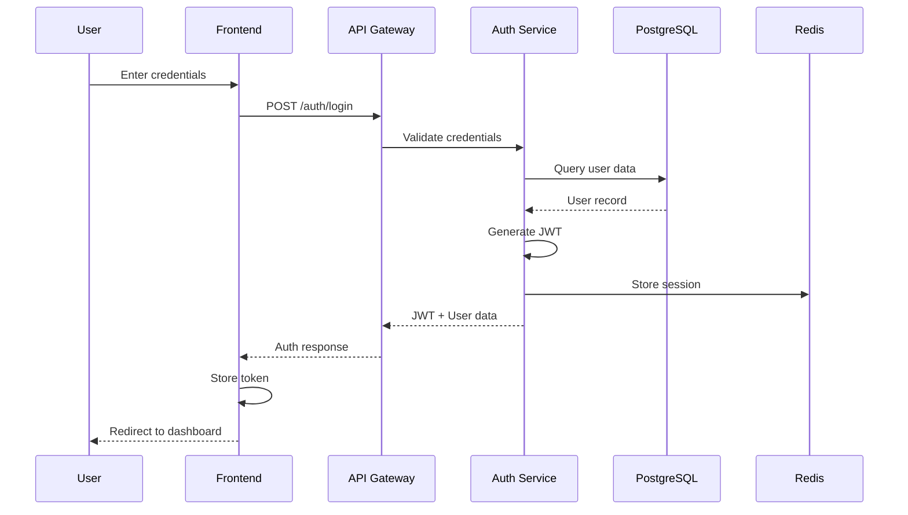
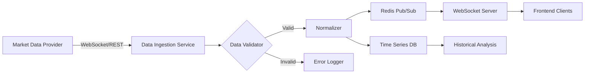
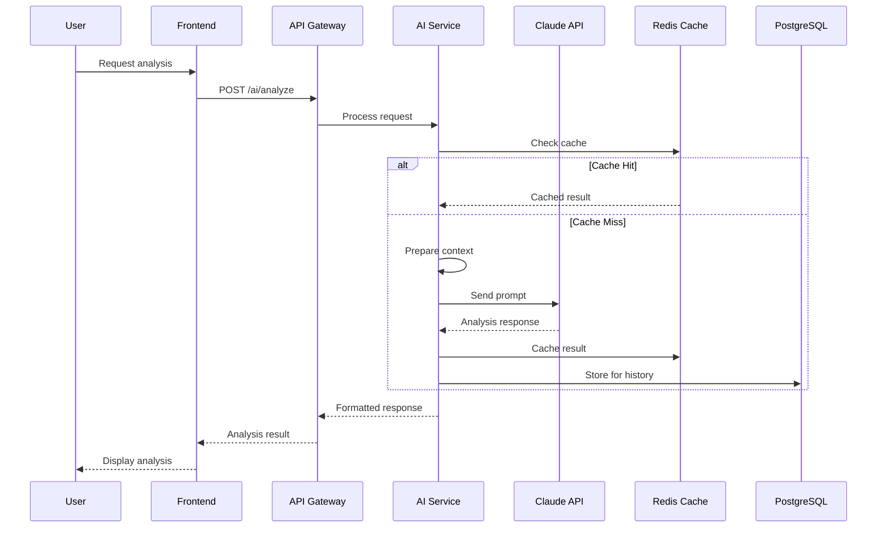
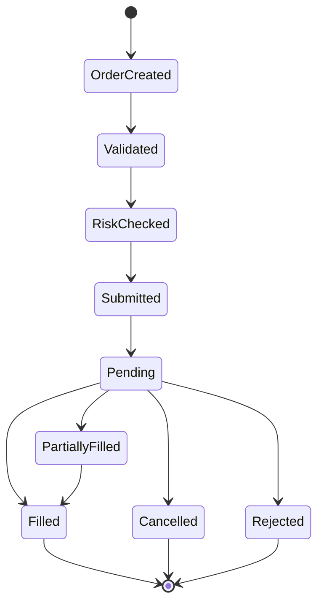
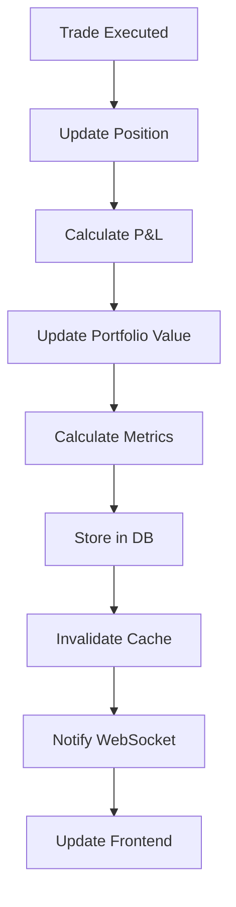

# Data Flow Architecture

## Overview
This document describes how data flows through the StarkMatter Trading Platform, from ingestion to presentation, including real-time and batch processing paths.

## Core Data Flows

### 1. User Authentication Flow


### 2. Real-Time Market Data Flow


### 3. AI Analysis Request Flow


### 4. Order Execution Flow


### 5. Portfolio Update Flow


## Data Ingestion Patterns

### Batch Processing
- **Frequency**: Configurable (1min, 5min, hourly)
- **Sources**: Historical data APIs, news feeds, SEC filings
- **Processing**: Celery workers
- **Storage**: PostgreSQL for structured, S3 for documents

### Stream Processing
- **Technology**: WebSocket connections, Server-Sent Events
- **Sources**: Real-time quotes, order updates, news alerts
- **Processing**: Async Python coroutines
- **Distribution**: Redis Pub/Sub to WebSocket clients

### Event-Driven Processing
```yaml
Events:
  - OrderPlaced:
      triggers:
        - Risk validation
        - Broker submission
        - Portfolio update
        - Notification

  - MarketDataUpdate:
      triggers:
        - Technical indicator calculation
        - Alert checking
        - UI update
        - AI analysis (throttled)

  - NewsArticleReceived:
      triggers:
        - Sentiment analysis
        - Keyword extraction
        - AI summarization
        - User notification

  - PortfolioChange:
      triggers:
        - P&L calculation
        - Risk recalculation
        - Performance metrics
        - Report generation
```

## Data Transformation Pipeline

### Market Data Pipeline
```python
# Conceptual pipeline
class MarketDataPipeline:
    stages = [
        "1. Raw Data Ingestion",
        "2. Data Validation",
        "3. Normalization",
        "4. Enrichment (calculations)",
        "5. Storage",
        "6. Cache Update",
        "7. Real-time Broadcast",
        "8. Batch Analytics"
    ]
```

### News Processing Pipeline
1. **Fetch**: Pull from RSS/APIs
2. **Parse**: Extract title, content, metadata
3. **Clean**: Remove HTML, normalize text
4. **Analyze**: Sentiment scoring, entity extraction
5. **Classify**: Categorize by relevance
6. **Store**: Save to database
7. **Index**: Update search index
8. **Notify**: Alert relevant users

## Data Storage Patterns

### Hot Data (Redis)
- Current market prices
- Active sessions
- Recent trades
- WebSocket connections
- Rate limit counters
- Short-term cache

### Warm Data (PostgreSQL)
- User profiles
- Recent transactions
- Active portfolios
- Configuration
- Audit logs
- Analytics data

### Cold Data (S3/Archive)
- Historical market data
- Old transactions
- Compliance records
- Backup data
- Log archives
- Report history

## Real-Time Data Distribution

### WebSocket Topics
```javascript
// Topic structure
const topics = {
  "market:quotes:{symbol}": "Real-time quotes",
  "market:depth:{symbol}": "Order book updates",
  "portfolio:{userId}": "Portfolio changes",
  "alerts:{userId}": "User-specific alerts",
  "news:all": "General news feed",
  "news:{category}": "Category-specific news",
  "ai:analysis:{requestId}": "AI analysis results"
};
```

### Subscription Management
```python
# Client subscription example
class SubscriptionManager:
    def subscribe(self, client_id, topics):
        # Add client to topic subscribers
        # Validate permissions
        # Send initial data snapshot
        # Start streaming updates

    def unsubscribe(self, client_id, topics):
        # Remove from subscribers
        # Clean up resources
```

## Data Synchronization

### Frontend State Sync
1. Initial load: Full state from API
2. WebSocket connection established
3. Subscribe to relevant topics
4. Receive real-time updates
5. Optimistic updates for user actions
6. Reconciliation on confirmation

### Database Replication
- Master-slave replication for reads
- Multi-master for high availability
- Point-in-time recovery
- Cross-region backup

## Error Handling & Recovery

### Data Quality Checks
```yaml
Validation Rules:
  Market Data:
    - Price within daily limits
    - Volume non-negative
    - Timestamp recent
    - Symbol valid

  User Input:
    - Order size limits
    - Price reasonableness
    - Account balance check
    - Risk limits

  AI Response:
    - Format validation
    - Content filtering
    - Length limits
    - Relevance scoring
```

### Recovery Mechanisms
1. **Circuit Breakers**: Prevent cascade failures
2. **Retry Logic**: Exponential backoff
3. **Dead Letter Queues**: Failed message handling
4. **Fallback Data**: Use cached/historical data
5. **Graceful Degradation**: Disable non-critical features

## Performance Optimization

### Caching Strategy
```yaml
Cache Layers:
  CDN:
    - Static assets
    - Public market data
    TTL: 1 hour

  Redis:
    - User sessions
    - Recent queries
    - Market snapshots
    TTL: 1-60 minutes

  Application:
    - Computed values
    - API responses
    TTL: 10-300 seconds
```

### Query Optimization
- Database indexes on frequently queried fields
- Materialized views for complex aggregations
- Query result caching
- Batch fetching for related data
- Pagination for large datasets

## Monitoring & Metrics

### Data Flow Metrics
- Ingestion rate (records/second)
- Processing latency (ms)
- Error rate (%)
- Cache hit ratio (%)
- WebSocket connections (count)
- API response time (ms)
- Database query time (ms)

### Alert Conditions
```yaml
Alerts:
  - DataIngestionStopped:
      condition: No data for 5 minutes
      severity: Critical

  - HighLatency:
      condition: p99 > 1000ms
      severity: Warning

  - CacheFailure:
      condition: Redis unreachable
      severity: Critical

  - DataQualityIssue:
      condition: Error rate > 5%
      severity: Warning
```

## Security Considerations

### Data in Transit
- TLS 1.3 for all connections
- Certificate pinning for mobile
- WebSocket over WSS
- API authentication required

### Data at Rest
- Database encryption
- Encrypted backups
- Secure key management
- PII tokenization

### Data Access Control
- Row-level security in database
- API endpoint permissions
- Data masking for logs
- Audit trail for access

## Compliance & Audit

### Data Retention
```yaml
Retention Policies:
  Trade Data: 7 years
  User Activity: 3 years
  Market Data: 2 years
  Logs: 90 days
  Sessions: 30 days
  Cache: Variable (minutes to hours)
```

### Audit Trail
Every data modification tracked:
- Who: User/Service ID
- What: Operation type
- When: Timestamp
- Where: Service/Endpoint
- Why: Business context
- Before/After: Data state